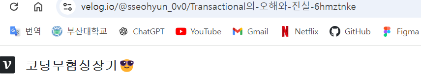

## 4주차 

### 이번주 작업 내용
1. 시큐리티 설정 (완료)
2. 로그인 : 카카오 소셜 로그인 구현 (구현중)
3. Member, Board, Like api 구현 (구현중)   

_현재 브랜치 병합 중이라 멘토링 전날까지 구현 완료해서 말씀드리겠습니다._

## 질문 사항
### 게시판 url에 슬러그 사용
게시판 URL에 게시판 id가 아닌 제목 기반으로 만든 슬러그를 이용할지 고민중에 있습니다.
(차후 검색에 노출이 잘 되도록 하기 위해서, 게시판에 한해서 슬러그를 도입하고 싶습니다.
그런데 이런 방식을 사용한다면 restful한 설계와 달라질텐데 이 부분 괜찮은지 궁금합니다. 

- board_id를 사용한 URl: `/board/{board_id}`

- 슬러그 도입시 : `/오늘-집주인한테-연락-옴`  : 가독성을 위해 board를 작성하지않음    

참고한 글과 기존 서비스
[참고글](https://seo.tbwakorea.com/blog/what-is-slug/)

## 개발 방식에 관해서 
api 개발 시, 필요한 Domain이 개발중인 경우, 임의로 가상 Domain class 를 만들어서 개발하는 것이 좋은지, 아니면 해당 Domain을 제외한 간단한 형태로 개발을 해 두는 것이 좋은지 궁금합니다.

