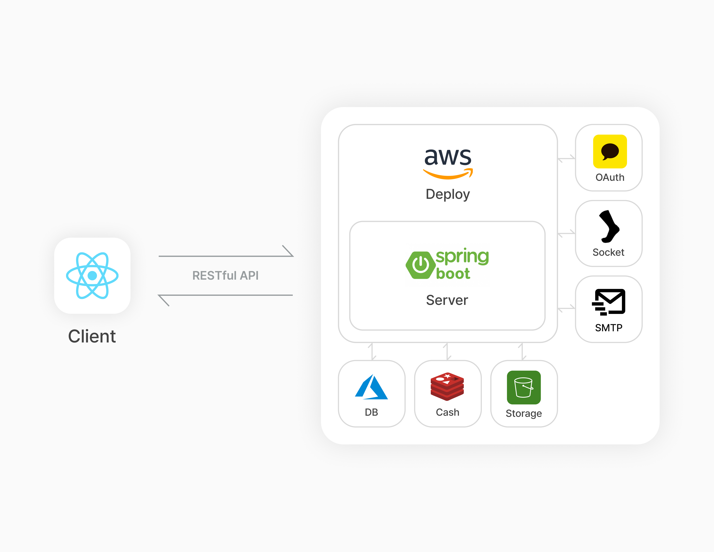

## Boomerang

## 프로젝트 소개
**부메랑**은 전세 사기 피해자들을 위한 **전세 사기 대처 웹 플랫폼**입니다.

집주인에게 간 보증금이 돌아오는 그날까지 함께하는 메이트가 되어드리겠습니다.

### 기획 배경
2024년 8월 기준 전세 사기 피해자는 2만명을 돌파했으며, 보증보험이 가입되어 있는 경우에는 국교교통부 전세사기 피해자로 인정이 안되어, 실제 피해자는 이보다 훨씬 많을 것으로 추정됩니다.

피해자들이 겪는 주요 어려움은 다음과 같습니다.  
- 복잡한 법률 용어와 절차에 대한 이해 부족
- 각종 서류 준비와 작성에 대한 심리적 부담
- 필요한 정보가 여러 사이트에 분산되어 있음
- 피해자들간의 정보 공유 커뮤니티 부재

### 프로젝트 가치
 부메랑은 전세 사기 피해자들이 환급 과정에서 겪는 복잡한 절차와 정보 부족의 어려움을 덜기 위해 개발되었습니다.     
 피해자들은 환급을 위해 사기 유형을 파악하고, 법적 용어를 이해하는 등 추가적인 피로를 겪습니다.      
 피해자들이 환급 과정에만 집중할 수 있도록, 유형 파악부터 환급까지 필요한 기능을 제공합니다.     
 또한, 채팅과 상담, 서류 작성 등 피해자들에게 실질적인 도움이 되는 기능들을 지속적으로 고민하며 발전시켰습니다.

### 문제 해결
**부메랑**은 피해자들이 복잡한 법적 절차를 쉽게 이해하고 진행할 수 있도록 도와드립니다:

- 사기 유형 검사와 맞춤형 가이드라인 제공
- 서류 자동 완성 기능
- 쉬운 법률 용어 설명 
- 전세사기 예방 안전도 검사
- 지식인 채팅 상담 서비스
- 피해자 커뮤니티 플랫폼

사용자들은 별도의 검색이나 사이트 방문 없이 부메랑 내에서 모든 과정을 일관되게 진행할 수 있습니다.

## 주요 기능별 설명

### 사기 유형 검사와 맞춤형 가이드라인 제공
#### 제공 가치
- 유저는 부메랑 사이트 내에서 유형검사와 해결 방법, 서류 작성까지 한번에 해결할 수 있습니다
- 꼭 방문해야 하는 외부 사이트의 경우 직접 링크를 제공합니다
- 피해자의 유형에 따른 단계별 상세 안내와 필요시 관련 사이트 주소를 제공합니다
- 
#### 기능 설명
- 계약 종류와 보험 가입여부에 따른 전세 사기 유형 검사를 실시합니다
- 전세 사기 유형별 맞춤형 환급 과정 정보를 제공합니다
- 환급 과정 완료도 체크를 통한 단계별 진행 관리가 가능합니다
- 각 단계별 상세 설명과 필요 서류를 안내합니다

---

### 서류 자동 완성 기능
#### 제공가치
- 복잡한 법률 서류 작성의 부담감을 해소합니다
- 다양한 기기에서도 편리하게 사이트 내에서 서류 작성 및 다운로드가 가능합니다
- 형식 오류 없이 정확한 서류 작성을 지원합니다

#### 기능 설명
- 사용자가 원하는 제출 서류의 필요한 입력 필드와 템플릿을 제공합니다.
- 사용자의 정보 입력을 바탕으로 제출 서류를 자동 완성합니다
- 완성된 서류를 PDF 형식으로 제공합니다

---

### 전세사기 예방 안전도 검사
#### 제공가치
- 잠재적 전세 사기 위험을 사전 파악할 수 있습니다
- 객관적인 지표를 통한 계약의 안전성을 검증합니다
- 추가 확인이 필요한 사항에 대한 해당 사이트 링크 및 정보를 제공합니다

#### 기능 설명
- 위험도 점수화를 통한 객관적 안전도를 평가합니다.     
   `(집값*0.8 - 채권액(등기부등본상 대출금) - 전세보증금 > 0)`

---

### 지식인 채팅 상담 서비스
#### 제공가치
- 전문가와의 실시간 상담을 통한 즉각적인 도움을 제공합니다
- 개인의 특수한 상황에 대한 맞춤형 조언이 가능합니다
- 법률 절차에 대한 전문적인 안내를 받을 수 있습니다

#### 기능 설명
- 소켓 기반으로 실시간 채팅 기반 전문가 상담을 제공합니다
- 상담사 업무 종료 시간과 채팅방 닫힘 시간 분리로 유연한 상담이 가능합니다
- 상담 내역 저장 및 조회가 가능합니다

---

### 피해자 커뮤니티 플랫폼
#### 제공 가치
- 피해자들 간의 정보 공유와 심리적 지지가 가능합니다
- 실제 경험담을 통한 실질적인 해결 방법을 공유합니다
- 안전하고 신뢰할 수 있는 소통 공간을 제공합니다
- 다양한 게시판을 통해 사용자의 상황에 맞는 맞춤형 정보를 확인할 수 있습니다
- 유용한 정보가 담긴 게시글을 베스트 게시글로 선정하여 더 많은 사용자에게 도움을 줍니다

#### 기능 설명
- 목적별 다양한 게시판을 운영합니다    
`(자유, 지역별, 시크릿, 단계별)`
- 베스트 게시글 시스템을 운영합니다:
   - 4시간마다 정각에 베스트 게시글을 선정합니다
   - 게시글 작성 후 7일간 유효합니다
   - 좋아요(×10점)와 댓글수(×7점)를 반영한 점수로 선정합니다
- 지식인 홍보 BM 및 사이트 내 상담기능을 위해 커뮤니티에서 개인적인 홍보를 막기 위해 전화번호를 필터링합니다
- 게시글 작성, 댓글 및 좋아요 기능을 제공합니다
- 카테고리별 게시글 분류 및 검색이 가능합니다

## API 명세서
- API의 상세한 사용법과 엔드포인트에 대한 정보는 아래 링크에서 확인할 수 있습니다
- [Boomerang API 명세서](https://documenter.getpostman.com/view/29615301/2sAXxY4oTG)

## 배포된 인스턴스 주소
- [Boomerang BE 인스턴스](http://52.79.80.3:8080/)

## 프로젝트 구조
### 시스템 아키텍쳐

+ ERD

## 팀원 소개

 <table>
   <tr>
     <td align="center" width="25%">
        
       <a href="https://github.com/jinseohyun1228" target="_blank">진서현</a> 
     </td>
     <td align="center" width="25%">
        
       <a href="https://github.com/Dalsungmin" target="_blank">문성민</a> 
     </td>
     <td align="center" width="25%">
        
       <a href="https://github.com/JaeBin2019" target="_blank">정재빈</a> 
     </td>
     <td align="center" width="25%">
        
       <a href="https://github.com/J-1ac" target="_blank">이상준</a> 
     </td>
   </tr>
 </table>

## 기간
>25 Aug 2024 ~ 15 Nov 2024

## 라이센스
>MIT License - Copyright (c) 2024 kakao-tech-campus-2nd-step3