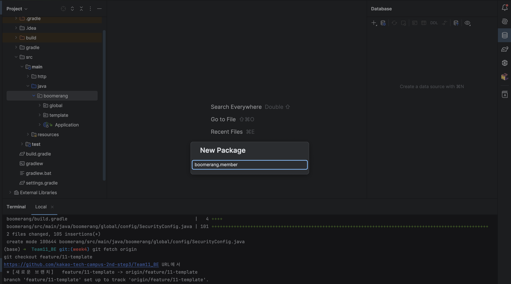
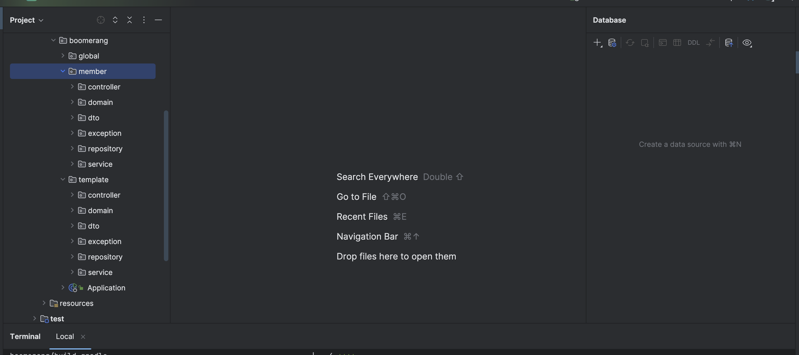
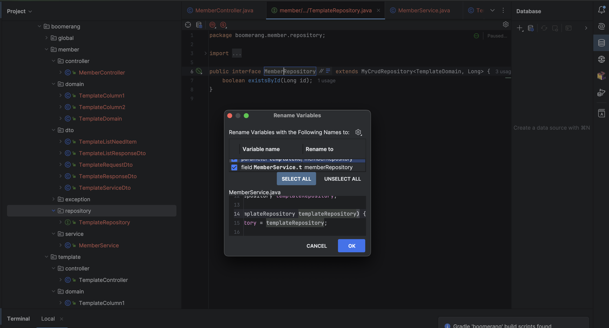
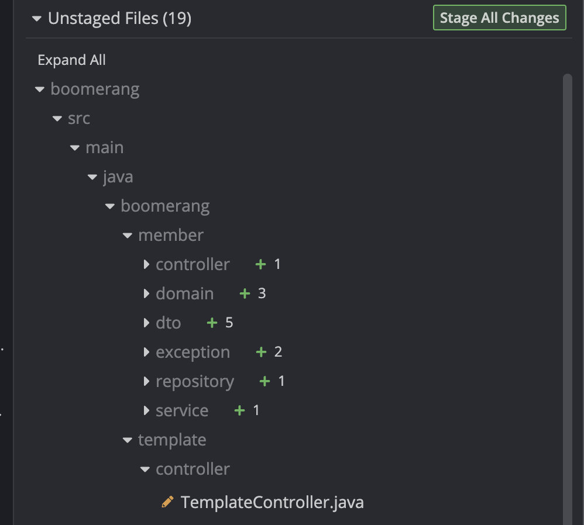
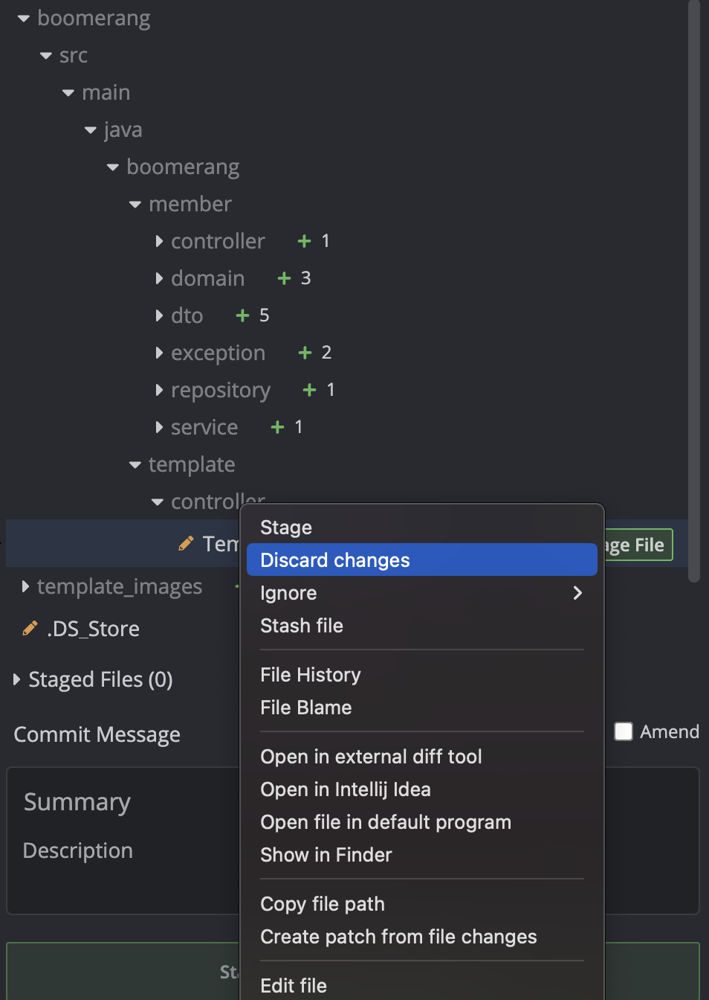
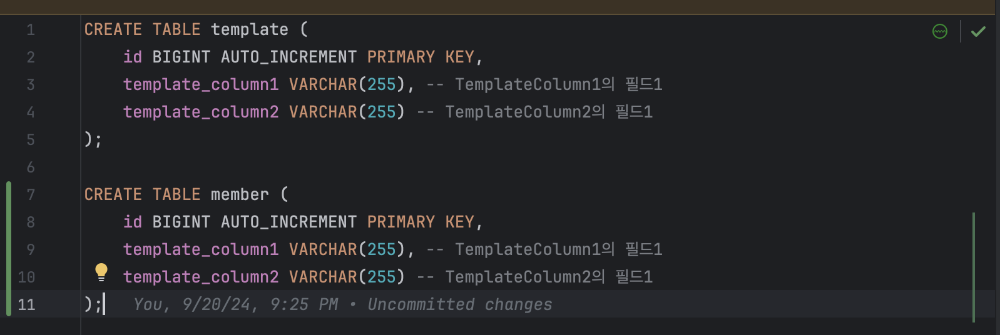
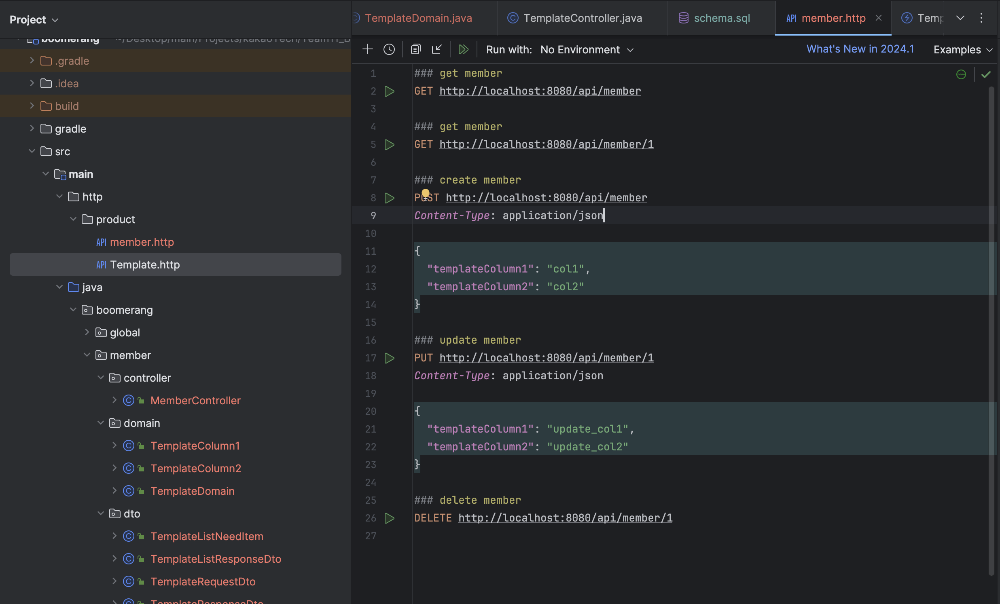

# 템플릿 코드 사용법

## 1. 폴더를 먼저 만든다

## 2. 해당 폴더에 template 폴더 아래를 전부 복사하여 붙여넣기 한다

## 3. 각 클래스의 이름을 shift + f6 을 통해 전부 변경해준다
1. Controller
2. Service
3. Repository
4. Dto
5. Domain
6. Exception  

순서로 이름 변경을 진행한다

Rename Variable 이 나온다면, SELECT ALL 을 누르고 OK

### Q. TemplateColumn1 의 private String value; 부분을 변경해야 하나요?

@Column(name = "template_column1") 의 name 부분만 실제 DB와 같은 값으로 변경하고, private String value; 는 그대로 유지하면 됩니다

## 4. 클래스명 변경 중 다른 repo 의 값이 바뀌었는지 확인

다음과 같이 member repo 이외의 곳에서 함께 값이 변경되는 경우가 있다  
반드시 확인해서 해당 부분은 discard 해주도록 하자

## 5. DB 연결과 CRUD 함수 동작 확인

이후 schema 에서 table 을 만들어 주고, 실행되는지 확인

마지막으로 http 통신까지 정상적으로 되는 지 확인해준다

# 반드시 모든 CRUD가 정상적으로 동작하는 것을 확인하고 Commit 하도록 한다
