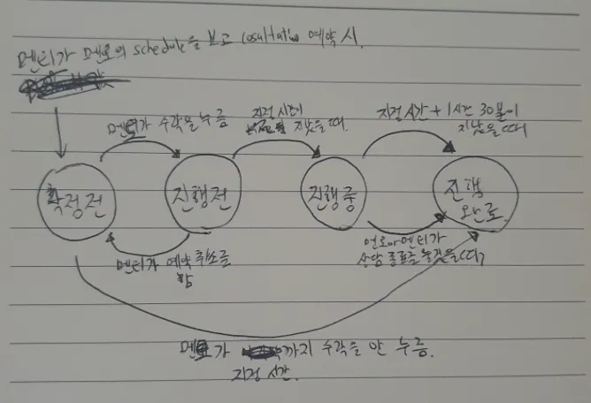
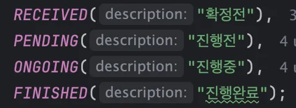
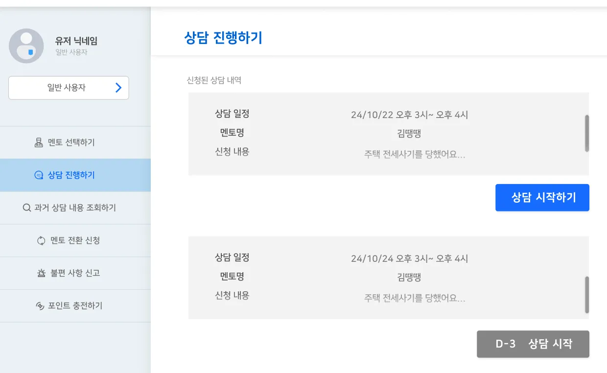
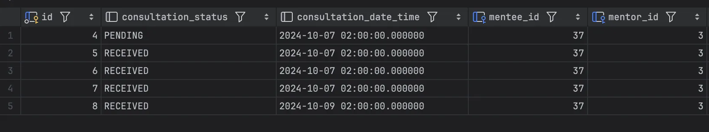

- **질문 1**
  - 상담 상태를 변경하는 방법을 어떻게 하는게 좋을까요?
  
  
  
    - 상태값이 조회시, 바뀌어야 하는 경우는 ‘진행전’ 과 ‘진행중’ 두 가지 경우가 있다
    - 현재 시간 < 상담 일정   ⇒   진행전 → 진행중
    - 현재 시간 < 상담 일정 + 1:30   ⇒      진행중 → 진행완료
    - 진행 완료의 경우, 대부분은 유저가 직접 ‘상담 완료’ 버튼을 눌러 상태가 변경되고, 깜빡하고 누르지 못한 경우에만 변경되기 때문에, 호출이 적다
    - 유저 입장에서, 상담 일정에 맞는 시간에 들어왔을 때, 상담 시작 버튼이 상담 시작하기로 변경되어야 한다
    - 유저가 상담 진행하는 날짜가 되기 전에는, 굳이 상담 진행하기 페이지에 들어와서 reload 하는 횟수를 생각해도, 5회 이상 api 요청이 일어날 것 같지 않다
  
    - 상담은 다음과 같이 DB가 구성되어 데이터가 저장되어 있다
  ```java
    public Page<Consultation> getConsultationPage(PrincipalDetails principalDetails,
                                                  ConsultationListRequestDto consultationListRequestDto) {
        updateConsulationStatus(consultationListRequestDto);

        PageRequest pageRequest = getConsultationPageRequest(consultationListRequestDto);
        Member member = memberService.getMemberByEmail(principalDetails.getMemberEmail());

        return consultationRepository.findAllByMember(
                member, consultationListRequestDto.getConsultation_status(), pageRequest);
    }

    private void updateConsulationStatus(ConsultationResponseDto consultationResponseDto) {
        ConsultationStatus consultationStatus = consultationResponseDto.getConsultationStatus();

				// 수락되지 않았거나 종료된 회의면, update 를 하지 않는다
        if (consultationStatus == ConsultationStatus.FINISHED || consultationStatus == ConsultationStatus.RECEIVED)
            return;

        consultationRepository.updateStatus(consultationStatus)
    }
    ```
  - 아직 수락되지 않았거나 종료된 회의면, update 를 하지 않는다
    
  ### 고민했던 방법
  1. DB조회하는 시점에서 변경 (현재 방식)
  2. 1시간 단위로 Scheduler 가 상태값을 바꾸는 방식
    
  Query 호출 수와 유저가 api 를 호출할 횟수를 고려해서 1번 방식이 좋다고 결론지었으나,
  혹시 놓쳤거나 더 좋은 방식이 있을 지 궁금합니다

- **답변 1**
    - 조회시 업데이트
        - GET임에도 불구하고 변경이 있다.
        - 객체지향 프로그래밍 원칙 SRP 위반
    - 2번째 스케줄링 잡을 추천
        - 상담 시간이 정시부터 정시까지라면 매 정시마다 update 스케줄링 잡을 돌리면 된다
        - 에러 로깅을 잘 해두면 문제 없을 것 같다
        - 예) 정시 -1분에 스케줄링 작업 시작

---

- **질문 2**
  - 상담 Entity 에서 멘토를 저장 할 때, Member 로 저장해도 될 지 궁금합니다
  ```java
    public class Consultation {

    @Id
    @GeneratedValue(strategy = GenerationType.IDENTITY)
    private Long id;

    @ManyToOne
    @JoinColumn(name = "mentee_id")
    private Member mentee;

    @ManyToOne
    @JoinColumn(name = "mentor_id")
    private Mentor mentor;
    
    ...
    }
    
    
    public class Member {
    
        @Id
        @GeneratedValue(strategy = GenerationType.IDENTITY)
        private Long id;
    
        @Column(unique = true)
        private String email;
    
        @Enumerated(EnumType.STRING)
        private MemberRole memberRole;
        
        ...
    }
    
    public class Mentor {
    
        @Id
        @GeneratedValue(strategy = GenerationType.IDENTITY)
        private Long id;
    
        @Enumerated(EnumType.STRING)
        private MentorType mentorType;
        
        @OneToOne(fetch = FetchType.LAZY)
        @JoinColumn(name = "member_id", nullable = false)
        private Member member;
        
        ...
    }    
  ```
    - Consultation 에서 Mentor 객체를 사용하여 멘토 를 저장하다 보니, 상담 쪽 로직에서 불필요하게 mentor.getMember() 를 호출해야하는 경우가 많아진다
    - 이 사람이 멘토인지 아닌지 검증하는 것을 입력값에서 수행하면, Consulation 객체에서 멘토를 Member 객체롤 저장하면 전체적인 로직이 간단해진다
    - 하지만, 이렇게 되면 상담에서 멘토가 Mentor 객체로 들어가지 않아, 차후 혼동이 오거나 문제가 예상치 못한 문제가 생길 수도 있을 것 같다
  
    때문에, 상담 쪽에서 멘토를 Member 객체로 받아도 될 지 궁금합니다

- **답변 2**
  - 기존 코드대로 Mentor를 유지하는게 어떨까요
  - Mentor만 가지고 있는 필드, 비즈니스 로직이 이미 많은 것 같다
  - 프로젝트 전반 도메인 기반의 패키지 구조를 가지고 있는데, 기존 Mentor가 조금 더 적합한 것 같다
  - Mentor가 사라지면 Member가 너무 커짐

---

- **질문 3**
  - ### 전반적으로 코드에서 부족한점
    저희 프로젝트에서 부족한 점이 무엇인지 궁금합니다.
    - 특히 실무자입장에서 봤을때 아쉬웠던 점이 궁금합니다.

- **답변 3**
  1. global → common
  2. IsDeleted → global로 이동
  3. TestController → 유지한다면 member.controller로 이동
  4. 서비스 레이어에서 PrincipalDetails를 의존하는 점. PrincipalDetails는 인증 객체인데 비즈니스 로직을 담당하는 서비스 메서드가 알고있어야한다는게 부담. A 서비스에서 B 서비스를 호출하는 일이 많은데, 확장성이 떨어진다. → 인증된 사용자 정보를 담는 DTO를 만들어서, PrincipalDetails를 DTO로 변환하고, 서비스에서는 해당 DTO를 입력받도록 개선

---
- **질문 4**
  - ### 성능개선할 부분
    배포를 하거나 프로젝트로 공부를 더 하고 싶습니다.
    저번 이메일 인증 과정에서 멘토님의 조언대로 비동기를 적용해 성능 개선을 한 부분이 도움이 되었습니다. (감사합니다 ~! )
    이 외에도  저희 프로젝트에서 성능개선을 할 수 있는 부분이 있을지 궁금합니다.

- **답변 4**
  - spring.jpa.show-sql: true 쿼리 나가는거 모니터링하고 N+1 쿼리 없는지 체크
  - 애플리케이션에서 사용하는 조회 쿼리를 리스트뽑고 mysql index 구성해보기
  - 성능테스트를 위해 nGrinder 공부해서 써본다
      - https://github.com/naver/ngrinder
  - 조회 redis 혹은 기타 캐시 넣기
      - https://www.baeldung.com/guava-cache
      - 기존 redis 캐시(메일 인증코드)는 유지
      - api 응답을 캐싱한다면 guava 추천 (베스트 게시물)

---
- **질문 5**
    ### 코딩 테스트 공부법
    - 멘토님꼐서는 어떻게 코딩테스트를 준비하셨나요? 공부 법이나, 책 (파이썬,자바, C++)  중에 추천해주실만한게 있으신가요?? 또 어떤 언어를 추천하시는지, (사용하셨는지) 궁금합니다.

- **답변 5**
    - 책 x
  - 백준 - 양치기 (골드 4, 3까지)
  - 프로그래머스 - level 3, 4까지, sql
  - 삼성 expert
  - 스터디, 혼자
  - python 추천
  - 본인이 좋아하는, 가장 잘아는 언어로 해도 무방
  - 코딩테스트 언어가 Java, C++로 한정된 곳이 가끔 있었다 요새는 잘 모르겠음 

---
- **질문 6**
    ### 자소서 작성 중 지원 동기 문항을 어떻게 적어야할지 고민됩니다.
    - 회사마다 지원동기를 쓰는 것이 어려운데, 멘토님은 직무위주로 쓰셨는지, 회사에 관한 이야기를 쓰셨는지 궁금합니다.
    - 직무기술서 분석이 어려운데, 멘토님께서는 어떻게 작성하셨는지 궁금합니다. 특히, 구체적인 기술 스택이 없이 포괄적인 기술서에는 어떻게 분석하셨는지 궁금합니다.
- **답변 6**
  - 직무 단위로 지원 - 특정 팀, 부서
      - it
      - 기술적인 관심
      - 서비스적 관심 (게임 헤비유저,,, 컨퍼런스 가서 들었다 감명,,,)
      - 문화적 관심 (스타트업, 토스 / 우형 / 당근 — 각자 컬쳐핏 중요하게 봄)
  - 회사 단위로 지원 - 공채
      - 회사와 나를 연관
      - 특별한 이벤트 (행사 참여, 지인, 뉴스, 인턴,,,,)
      - 이 회사에 대한 충성심? 로열티? 관심, 성의
      - 전통 대기업
      - 뉴스 찾아서 키워드 뽑고, 이런 사업 / 이런 일에 기여하고 싶다
  - 자기소개서 및 이력서 첨부하세요 (자유)
      - 이력서만 넣어도 괜찮음
  - 자기소개서 첨부하세요 (자유) (총 합 1000자? 1500자?)
      1. 지원 동기
      2. 나의 이력서를 정리하는 문항, 나의 경험
      3. 목표 (짧게)

---
- **질문 7**
    ### CS공부 중 추천해주실 만한 책이나 강의, 주제가 있나요
  - 멘토님께서 취준,공부를 하시면서 추천하실만한 것이 있는지 궁금합니다.
- **답변 7**
  - 방향성
    - https://github.com/kamranahmedse/developer-roadmap 로드맵 참고
  - CS
    - https://github.com/JaeYeopHan/Interview_Question_for_Beginner
    - https://github.com/WeareSoft/tech-interview
    - https://github.com/kjsu0209/Tech-Interview
    - 위 기본 질문 기반으로 내 이력서(포트폴리오) 관련된 기술 스택까지 커버
  - 책
    - 오브젝트: oop 언어를 사용하고 있다면 꼭 읽기. 한국인 작가. / 객체지향의 사실과 오해
    - 모던자바인액션: 자바8+ 프로그래밍 코드를 짜고싶다면 모던자바
    - 이펙티브자바: 난이도 중간. 자바 코드를 어떻게 하면 잘 쓸 수 있는가를 보려면 이펙티브자바 (개인적으로 클린코드와 비슷한 이야기를 자바 버전으로 해주는 듯함)
    - 클린코드: 난이도 쉬움. 당연한 말. 무조건 원칙을 따라야하는건 아니지만 따른다면 코드가 매우 깔끔해질 것
  - 강의
    - 김영한 스프링부트와 jpa 활용 (인프런) + 자바orm표준jpa프로그래밍 → 이미 카테캠 내용으로도 충분히 잘 아실듯